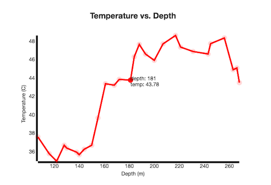

# Water Column Profile Plugin
This plugin allows the user to view real time interactive graphs of the water column the ROV is being flown in. The graphs have scrollover features that allow users to see the numeric values of each data point. The plugin heavily relies on the power of D3 and Polymer. The water column graphs can be created for any data type (not just temperature), and the graphs are animated in real time with D3's transitions.

  

